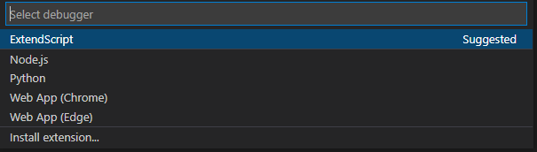

# Running Photoshop Scripts

## Install:
### Using ExtendScript Toolkit:
1. Download ExtendScript Toolkit from [here](https://www.adobe.com/devnet/scripting/estk.html).
2. Set the proper Photoshop interpreter:\


### Using Visual Studio Code:
1. Download VSCode from [here](https://code.visualstudio.com/download).
2. In the **Extension** tab of the VSCode search for `adobe.extendscript-debug` and install.
3. Open the folder containing the scripts. Then __open the file that you want to run__.
4. From `Run and Debug` tab you can either,
   1. start the Run/Debug using `Run and Debug`\
   \
   select `ExtendScript`\
   \
   select Host application `Adobe Photoshop 20202`\
   

   or 

   2. you can `create a launch.jason file` and with your own configuration.\
      The defaul configuration comes with `Attach to ExtendScript Engine` and `Launch Script in ExtendScript Engine` modes.
      ```js
        {
            // Use IntelliSense to learn about possible attributes.
            // Hover to view descriptions of existing attributes.
            // For more information, visit: https://go.microsoft.com/fwlink/?linkid=830387
            "version": "0.2.0",
            "configurations": [
                {
                    "type": "extendscript-debug",
                    "request": "attach",
                    "name": "Attach to ExtendScript Engine"
                },
                {
                    "type": "extendscript-debug",
                    "request": "launch",
                    "name": "Launch Script in ExtendScript Engine"
                }
            ]
        }
       ```
    
       `Attach to ExtendScript Engine` does not start the debugging and you should run the `ExtendScript: Evaluate Script in Host..` command.

       `Launch Script in ExtendScript Engine` runs the script in the host application (for example Photoshop).

       (Preferred) If you know your host application (by running the `launch` mode), you can specify it as a parameter in the configuration mode or by creating a new mode:

       ```js
       {
           // Use IntelliSense to learn about possible attributes.
           // Hover to view descriptions of existing attributes.
           // For more information, visit: https://go.microsoft.com/fwlink/?linkid=830387
           "version": "0.2.0",
           "configurations": [
               {
                   "type": "extendscript-debug",
                   "request": "attach",
                   "name": "Attach to ExtendScript Engine"
               },
               {
                   "type": "extendscript-debug",
                   "request": "launch",
                   "name": "Launch Script in ExtendScript Engine"
               },
               {
                   "type": "extendscript-debug",
                   "request": "launch",
                   "name": "Debug Photoshop",
                   "hostAppSpecifier": "photoshop-140.064",
                   "stopOnEntry": false
               }
           ]
       }
       ```

       Now you can select between different modes:\
       

5. Restart VSCode and close Photoshop.
6. Start debugging!

### Using Webstrom:
1. __Suppress the RunningScripts warning.__ Follow [this](https://helpx.adobe.com/photoshop/kb/enable-optional-extensions-photoshop-cc.html#:~:text=Save%20the%20file%20as%20%22PSUserConfig,%5C%5BPhotoshop_version%5D%5C%5BPhotoshop_version%5DSettings%5C) instruction:

    1. Navigate to `\Users\[User Name]\AppData\Roaming\Adobe\[Photoshop_version]\[Photoshop_version]Settings\`
    2. Open/create `PSUserConfig.txt`
    3. Insert `WarnRunningScripts 0`

2. Download WebStrom from [here](https://www.jetbrains.com/webstorm/download).
   
3. Create new WebStorm project and set the interpretor to:

    `C:\Program Files\Adobe\Adobe Photoshop 2020 \Photoshop.exe`


## Tutorials:
### ScriptUI:
- I found [this](_rsrcs/scriptui.pdf) tutorial from [here](https://adobeindd.com/view/publications/a0207571-ff5b-4bbf-a540-07079bd21d75/92ra/publication-web-resources/pdf/scriptui-2-16-j.pdf) very useful!
- [This](https://scriptui.joonas.me/) is a great tool for creating the UI. 
